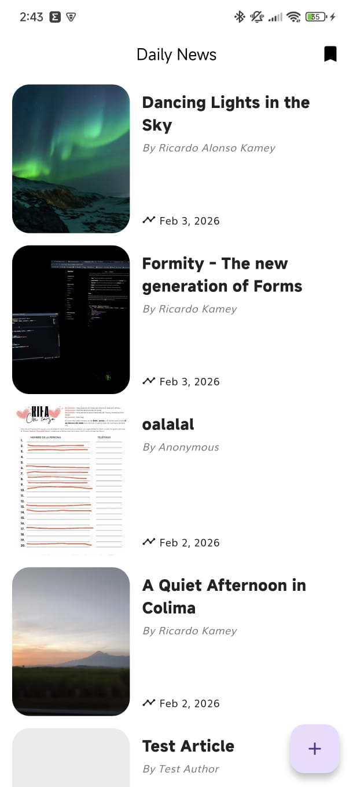
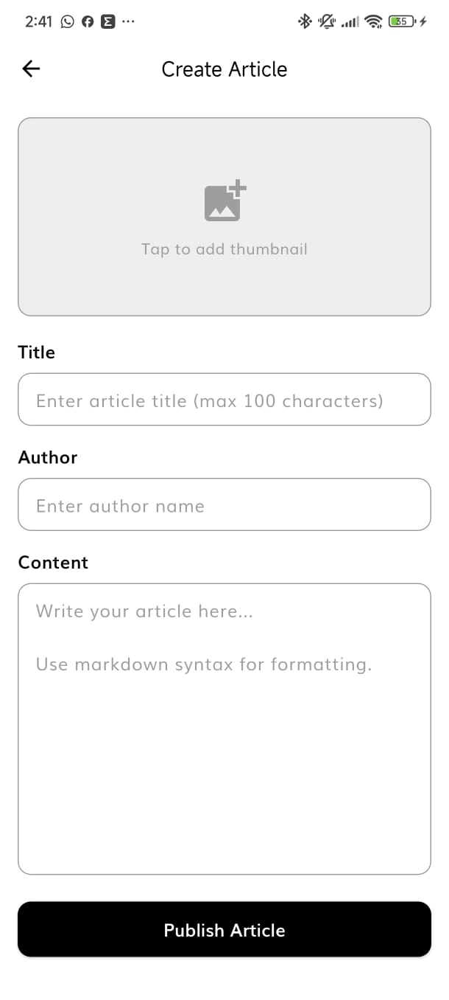
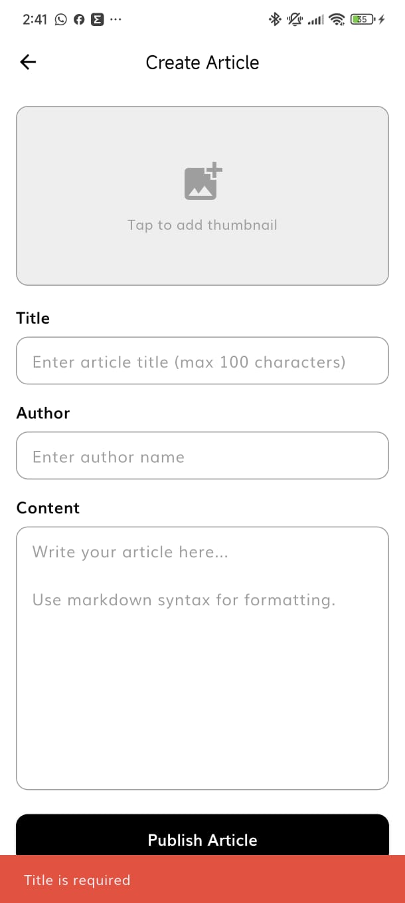
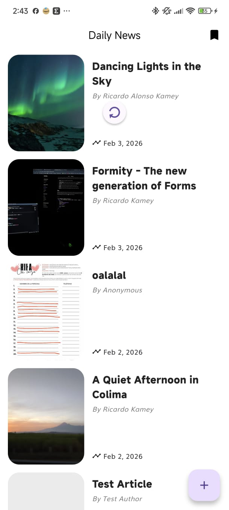
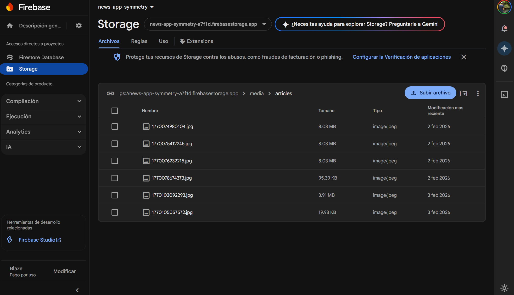
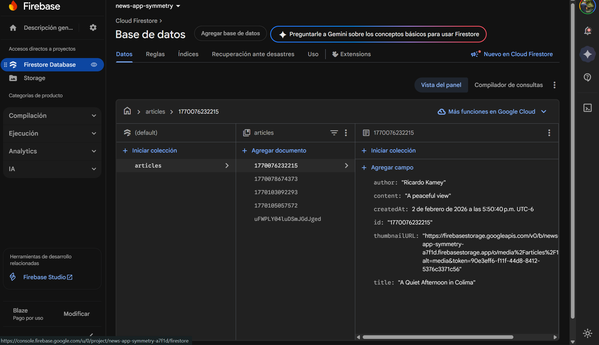

# Project Report
## Applicant Showcase App — Symmetry Technical Assessment
**February 2026**

---

## 1. Introduction

When I first saw the Applicant Showcase App project, my initial reaction was a mix of excitement and uncertainty. The project required technologies I had never worked with before — Flutter, Dart, Firebase, and the BLoC pattern — which made it a significant challenge from the start.

My background is primarily in web development with React, where I have learned to navigate unfamiliar frameworks by diving directly into hands-on development. That same philosophy guided my approach here: rather than spending days reading documentation in isolation, I decided to learn by building, adapting, and iterating directly on the codebase.

This report documents the full journey: how I learned the required technologies, the obstacles I faced, how I overcame them, and the additional features I implemented to go beyond the basic requirements.

---

## 2. Learning Journey

### 2.1 Getting Familiar with Dart

Dart was the first technology I tackled since it is the foundation of everything in Flutter. Before starting the project, I had zero experience with the language. I spent time studying Dart's core concepts — strong typing, null safety, classes, and the differences with JavaScript/TypeScript — and even created personal notes in Notion to consolidate what I learned. This step was crucial because it allowed me to understand Flutter code without constantly struggling with the language itself.

### 2.2 Exploring Flutter and Firebase

After getting comfortable with Dart, I briefly explored Flutter and its integration with Firebase. However, I quickly realized that reading tutorials and watching videos at a slow pace was not the most efficient approach for me. Based on my experience learning React — where I learned best by building real projects — I made the decision to jump directly into the project and learn by doing.

### 2.3 Learning by Doing

This turned out to be the right call. By working directly with the existing codebase (especially the `daily_news` feature), I was able to understand the project's architecture and patterns much faster than I would have by following generic tutorials. I used the existing code as a reference and replicated its structure for the new `user_articles` feature.

Throughout this process, I relied on several resources: Stack Overflow for specific error solutions, YouTube videos for Firebase and Flutter integration concepts, and Claude/ChatGPT for debugging and resolving technical roadblocks. This combination proved highly effective and kept the momentum going.

---

## 3. Challenges Faced

| Challenge | How I Overcame It |
|-----------|-------------------|
| **Dependency & version conflicts** | Several Flutter packages were incompatible with my Android device. I investigated each error individually, updated dependencies in `pubspec.yaml`, and ran `flutter pub upgrade` to resolve version mismatches. |
| **Learning Flutter & Dart from scratch** | I had no prior experience with either technology. I used the existing `daily_news` feature as a live reference, studied its entity, model, repository, bloc, and page structure, and replicated the same patterns for `user_articles`. |
| **Connecting Flutter with Firebase** | Integrating Firebase Firestore and Cloud Storage into a Flutter app was new territory. I followed official Firebase documentation and video tutorials to configure `google-services.json`, initialize Firebase in `main.dart`, and wire up the SDK correctly. |
| **Firebase Storage permission errors (403)** | Uploading thumbnails initially failed with `Permission Denied` errors. The root cause was overly restrictive Storage rules and a missing `contentType` in the upload metadata. I fixed this by adding `SettableMetadata` with the correct MIME type and adjusting the rules. |
| **Firebase Firestore rules validation** | The schema validation rules initially rejected writes because the `thumbnailURL` format changed from a relative path to a full Firebase download URL. I updated the rules to validate the string without the path pattern restriction. |
| **Exposed API key in GitHub commit** | After pushing to GitHub, I received a warning about an exposed API key. I immediately rotated the key in the Firebase console and generated a new one, ensuring the exposed key is no longer valid. |

Each of these challenges forced me to think critically and research solutions independently. The most valuable lesson was learning to read error messages carefully — in most cases, the solution was directly indicated by the error output.

---

## 4. Reflection and Future Directions

### 4.1 Technical Learnings

This project gave me a deep understanding of Clean Architecture in a mobile context. The separation into Domain, Data, and Presentation layers initially felt abstract, but once I started building within it, the logic became clear. Each layer has a very specific responsibility, and violations are easy to spot.

I also gained practical experience with dependency injection using GetIt, state management with BLoC, and Firebase's Firestore and Cloud Storage SDKs. These are all highly transferable skills for future Flutter projects.

### 4.2 Professional Learnings

Working within an established codebase with defined architecture guidelines taught me the importance of consistency. Rather than reinventing the wheel, following the existing patterns (entity structure, use case signatures, bloc event/state design) made the new feature integrate seamlessly with the rest of the app.

The experience also reinforced my belief in learning by doing. The combination of diving into code, hitting walls, researching solutions, and iterating produced faster and deeper learning than any tutorial could have.

### 4.3 Future Directions & Suggestions

- **Authentication:** Implement Firebase Authentication so that articles are tied to specific users and only the author can edit or delete their own articles.
- **Article editing:** Add an "Edit" flow so users can update existing articles after publication.
- **Categories & search:** Allow users to tag articles with categories and implement a search bar to filter articles by keyword or category.
- **Pagination:** Implement cursor-based pagination for the articles list to avoid loading all documents at once as the collection grows.
- **Offline support:** Use Firestore's built-in offline persistence to allow users to read cached articles even without an internet connection.
- **Unit & widget tests:** Add comprehensive tests for use cases, repositories, blocs, and key widgets to ensure reliability.

---

## 5. Proof of the Project

### Demonstration Video
[Watch the demonstration video here](https://drive.google.com/file/d/1ANaSDSvPFcjSNXxqvd8ErLBj3lNTdjDc/view?usp=sharing)

### Articles List

### Create Article

### Form Validation

### My Articles with Pull-to-Refresh

### Markdown Rendering

### Firebase Storage - Uploaded Thumbnail

### Firebase Firestore - Stored Documents

---

## 6. Overdelivery

Beyond the core requirements, the following additional features and improvements were implemented to demonstrate commitment to exceeding expectations.

### 6.1 New Features Implemented

#### 🔄 Pull-to-Refresh on Articles List
The Daily News page supports pull-to-refresh, allowing users to reload the list of articles from Firestore with a simple swipe gesture. This provides real-time feedback without navigating away from the screen.

#### 📝 Markdown Support in Article Content
Article content is rendered with Markdown formatting support. Users can use bold, italic, headers, and lists in their article body, making the content richer and more expressive.

#### ✅ Form Validation
The Create Article form includes comprehensive validation: all fields (title, author, content) must be filled before submission. If any field is empty, a clear error SnackBar is shown to the user, preventing incomplete articles from being saved.

#### 📏 Title Character Limit (100 characters)
The article title is limited to 100 characters to ensure consistency and readability across the app. This constraint is enforced at the input level.

#### 🎨 Improved UI & Visual Design
The overall UI was refined with polished card designs, consistent spacing, smooth shadows, and a clean visual hierarchy. The article tiles and creation form follow a modern, minimal aesthetic that feels professional and intuitive.

#### 📅 Date Formatter in Article Tiles
Each article tile displays the creation date in a human-friendly format (e.g., `Feb 3, 2026`) instead of a raw timestamp, improving readability and visual polish.

#### 👤 Author Name in Article Tiles
The author's name is displayed prominently in each article tile, giving proper credit and making the list more informative at a glance.

### 6.2 Architecture Decision: Separate Feature (`user_articles`)

A deliberate architectural decision was made to implement the article creation functionality as a separate feature (`user_articles`) rather than extending the existing `daily_news` feature. This decision was made for the following reasons:

- **Single Responsibility:** `daily_news` is responsible for displaying external API news. `user_articles` handles user-created content stored in Firebase. These are fundamentally different data sources and concerns.
- **No Risk of Breaking Existing Code:** By keeping the features separate, the existing news listing, favorites, and detail views remain completely untouched and stable.
- **Scalability:** If new data sources or features are added in the future (e.g., a third-party blog API), they can each have their own clean feature folder without polluting the others.
- **Clean Architecture Compliance:** This separation directly follows the project's architecture guidelines — each feature encapsulates its own domain, data, and presentation layers independently.

### 6.3 How Can We Improve Further

- **Rich text editor:** Replace the plain text input with a rich text editor (e.g., `flutter_quill`) so users can format their articles visually before publishing.
- **Image cropping & resizing:** Add an in-app image cropping step before uploading the thumbnail to ensure consistent aspect ratios across all article cards.
- **Draft mode:** Allow users to save articles as drafts before publishing, stored locally or in a separate Firestore collection.
- **Social sharing:** Add the ability to share articles via SMS, email, or social media using Flutter's `share_plus` package.
- **Analytics:** Integrate Firebase Analytics to track article views, creation frequency, and user engagement patterns.
- **Push notifications:** Use Firebase Cloud Messaging to notify users when new articles are published.

---

## 7. Extra — Architecture Overview

The following table summarizes the file structure and responsibilities of the `user_articles` feature, showcasing how it follows the Clean Architecture pattern established in the project.

| Layer / File | Responsibility |
|--------------|----------------|
| `domain/entities/user_article_entity.dart` | Defines the core business object (`UserArticleEntity`) with no external dependencies. |
| `domain/repositories/user_article_repository.dart` | Abstract repository interface that defines what operations are available (CRUD + upload). |
| `domain/usecases/get_user_articles.dart` | Use case: retrieves the list of user articles from the repository. |
| `domain/usecases/create_user_article.dart` | Use case: creates a new article via the repository. |
| `domain/usecases/delete_user_article.dart` | Use case: deletes an article by its ID. |
| `domain/usecases/upload_thumbnail.dart` | Use case: uploads a thumbnail image to Firebase Cloud Storage. |
| `data/models/user_article_model.dart` | Extends the entity; handles conversion from/to Firestore documents. |
| `data/data_sources/user_article_firebase_data_source.dart` | The only layer that directly talks to Firebase Firestore and Storage. |
| `data/repositories/user_article_repository_impl.dart` | Implements the abstract repository; wraps data source calls in `DataState`. |
| `presentation/bloc/user_article_bloc.dart` | Manages async state transitions: loading, success, error, creating. |
| `presentation/bloc/user_article_event.dart` | Defines the events the bloc can receive (get, create, delete). |
| `presentation/bloc/user_article_state.dart` | Defines all possible UI states for the articles feature. |
| `presentation/pages/create_article_page.dart` | The form UI for creating a new article with validation and image picker. |

---

*Thank you for your time reviewing this report.*